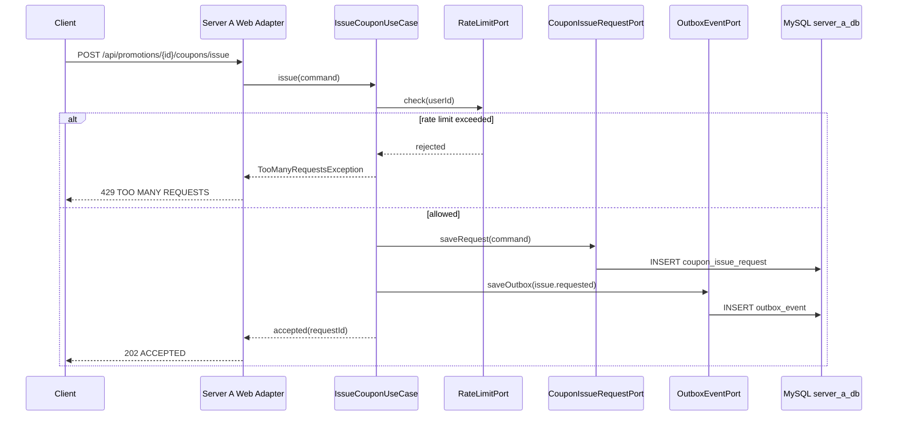
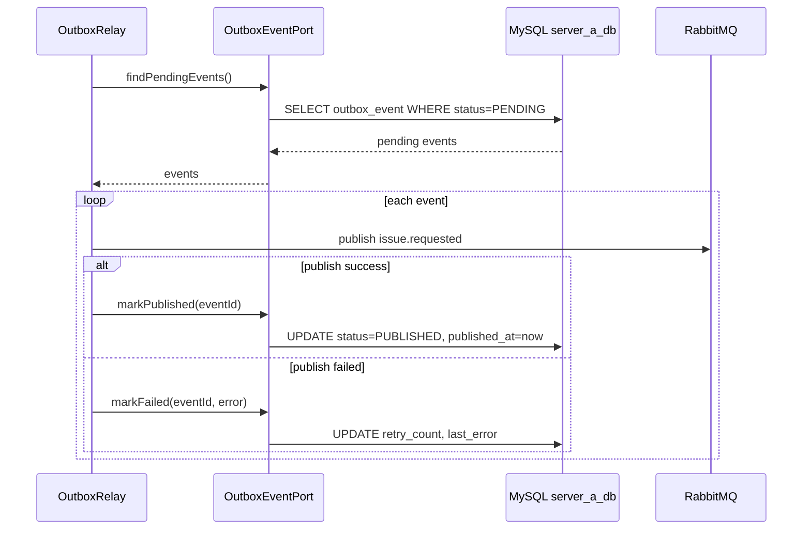
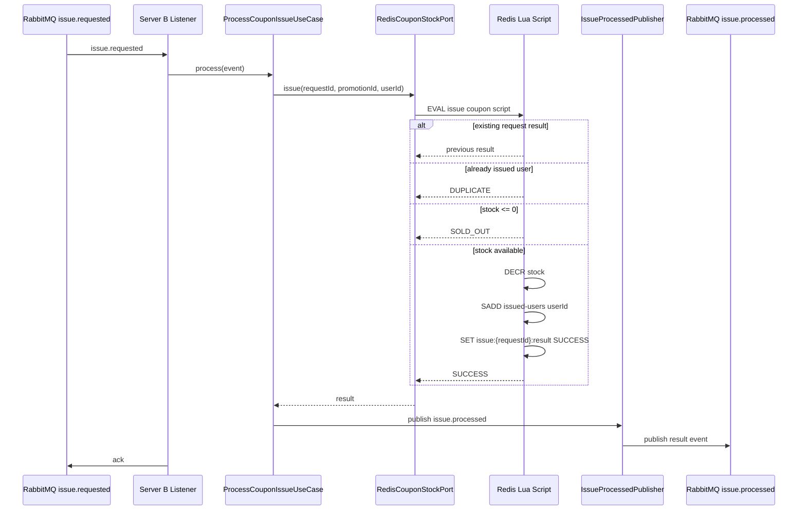
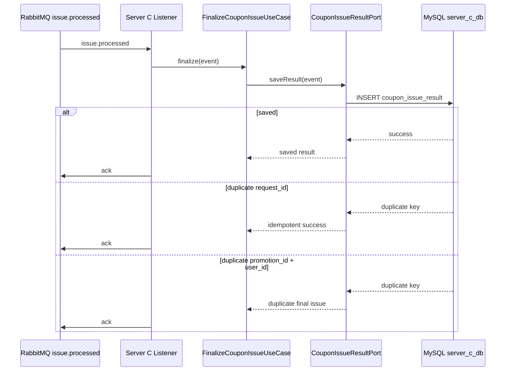
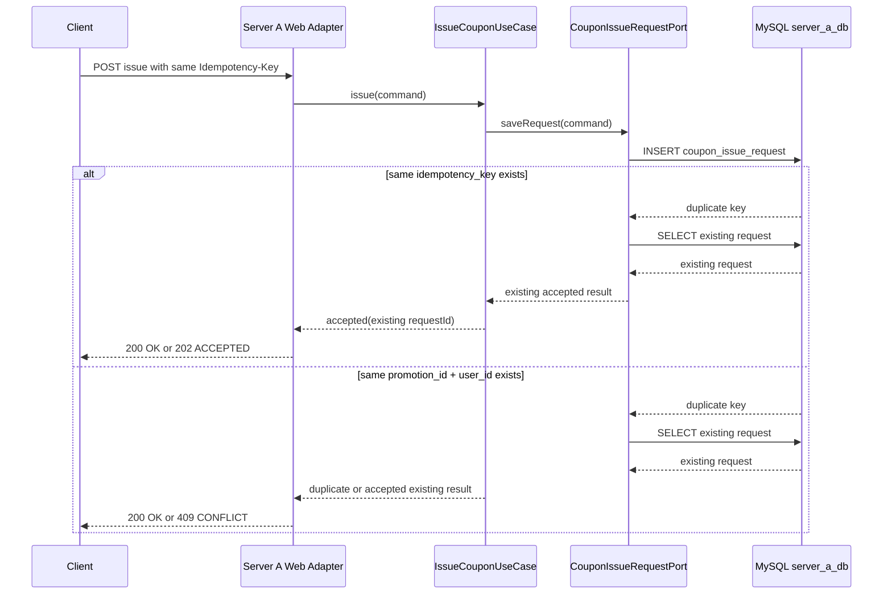
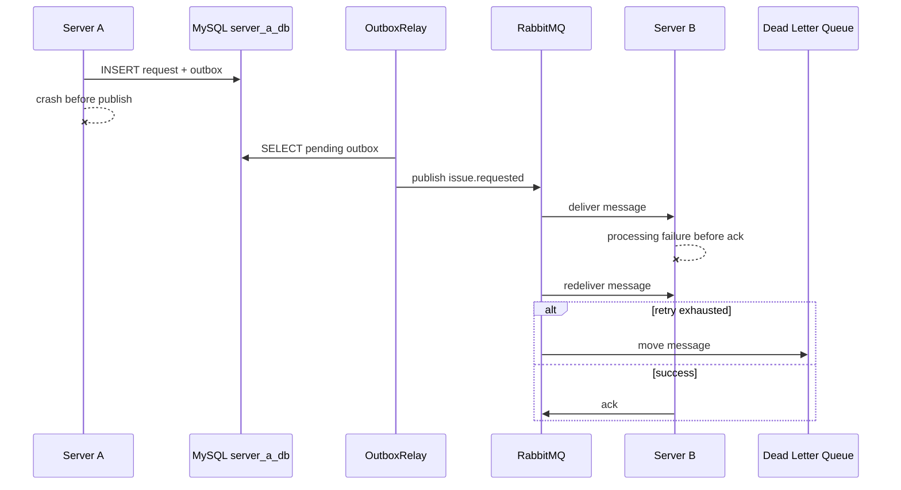
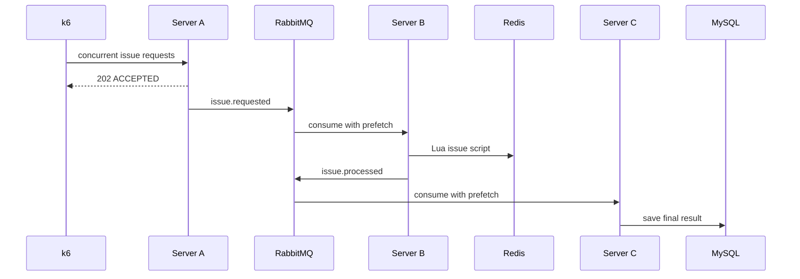

# 시퀀스 다이어그램

> Promotion Dispatcher 주요 런타임 흐름 (현재 설계 기준)

## 목차

- [쿠폰 발급 요청 접수](#쿠폰-발급-요청-접수)
- [Outbox 발행](#outbox-발행)
- [Server B 쿠폰 처리](#server-b-쿠폰-처리)
- [Server C 최종 저장](#server-c-최종-저장)
- [멱등성 재요청](#멱등성-재요청)
- [장애 및 재시도](#장애-및-재시도)
- [부하 테스트 흐름](#부하-테스트-흐름)

---

## 쿠폰 발급 요청 접수

핵심 포인트

- Server A는 최종 발급 결과를 기다리지 않는다.
- request log와 outbox event는 같은 transaction에 저장한다.
- 사용자별 과도한 요청은 rate limit으로 초기에 차단한다.

---

## Outbox 발행

핵심 포인트

- DB commit 이후 RabbitMQ 발행 전에 Server A가 죽어도 outbox가 남는다.
- relay는 pending event를 재조회해 발행을 재시도한다.
- `status, created_at` index로 pending event 조회를 최적화한다.

---

## Server B 쿠폰 처리

핵심 포인트

- Redis Lua script가 재고 확인, 중복 확인, 차감을 원자적으로 처리한다.
- `issue:{requestId}:result`가 있어 재전달 시 결과가 바뀌지 않는다.
- 메시지는 처리와 발행이 끝난 뒤 ack한다.

---

## Server C 최종 저장

핵심 포인트

- Server C는 최종 정합성 방어선이다.
- `request_id` unique constraint는 동일 이벤트 재처리를 막는다.
- `promotion_id + user_id` unique constraint는 최종 중복 발급을 막는다.

---

## 멱등성 재요청

핵심 포인트

- 같은 idempotency key의 재요청은 새 이벤트를 만들지 않는다.
- 같은 사용자와 같은 프로모션 조합은 한 번만 접수한다.
- 최종 중복 방어는 Server C에서도 한 번 더 수행한다.

---

## 장애 및 재시도

핵심 포인트

- Server A 장애는 outbox relay로 복구한다.
- Server B/C 장애는 RabbitMQ ack와 재전달로 복구한다.
- 반복 실패 메시지는 DLQ로 격리해 전체 파이프라인을 막지 않는다.

---

## 부하 테스트 흐름

측정 포인트

- Server A HTTP TPS
- p95 latency
- HTTP error rate
- RabbitMQ backlog
- Redis 처리 결과 분포
- Server C 최종 저장 건수
