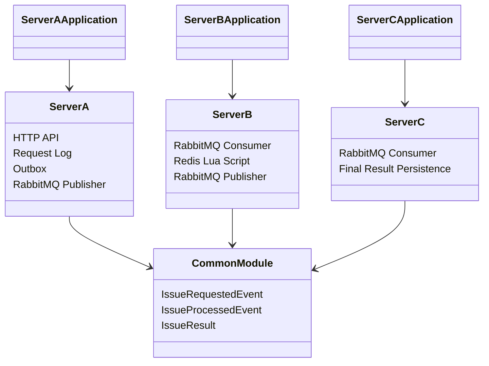
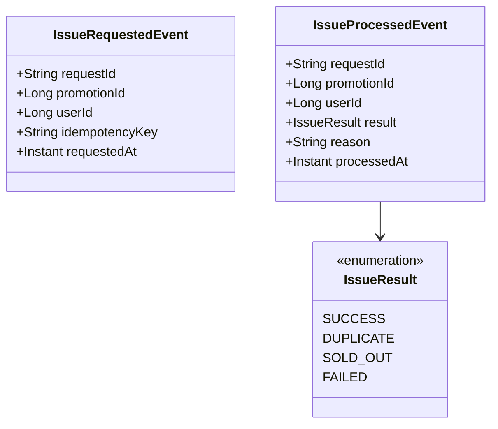
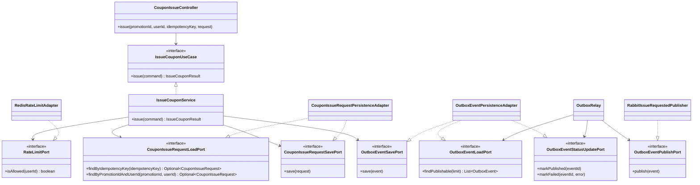
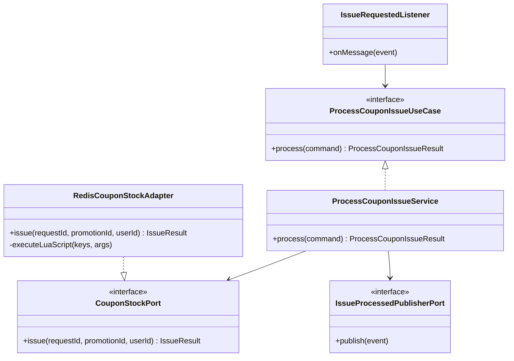
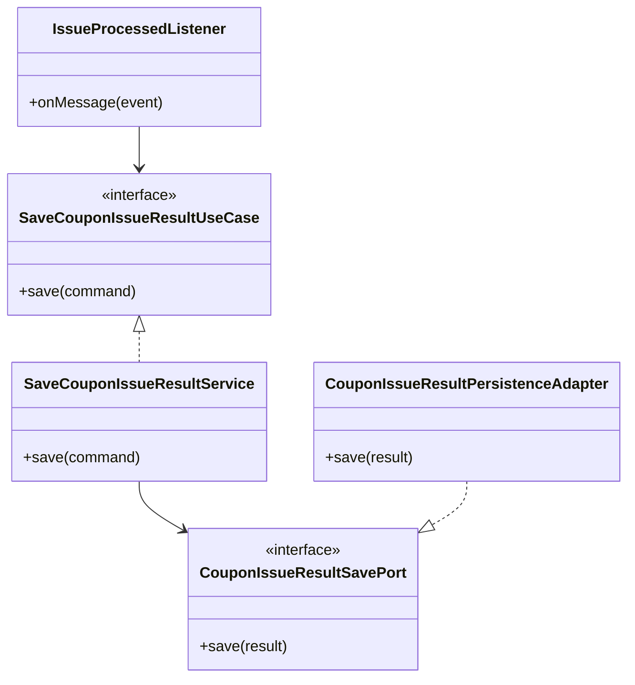

# 클래스 다이어그램

> Promotion Dispatcher 계층 구조와 핵심 클래스 관계 (현재 설계 기준)

## 목차

- [전체 구조](#전체-구조)
- [공통 이벤트 모델](#공통-이벤트-모델)
- [Server A 클래스 구조](#server-a-클래스-구조)
- [Server B 클래스 구조](#server-b-클래스-구조)
- [Server C 클래스 구조](#server-c-클래스-구조)
- [어댑터 책임](#어댑터-책임)
- [핵심 클래스 책임 요약](#핵심-클래스-책임-요약)

---

## 전체 구조

---

## 공통 이벤트 모델

---

## Server A 클래스 구조

---

## Server B 클래스 구조

---

## Server C 클래스 구조

---

## 어댑터 책임

| 어댑터 | 구현 port | 책임 |
|---|---|---|
| `CouponIssueRequestPersistenceAdapter` | `CouponIssueRequestLoadPort`, `CouponIssueRequestSavePort` | 요청 접수 원장 저장과 중복 조회 |
| `OutboxEventPersistenceAdapter` | `OutboxEventSavePort`, `OutboxEventLoadPort`, `OutboxEventStatusUpdatePort` | outbox 저장, 발행 대상 조회, 발행 상태 갱신 |
| `RabbitIssueRequestedPublisher` | `OutboxEventPublishPort` | A -> B 메시지 발행과 broker confirm 대기 |
| `RedisRateLimitAdapter` | `RateLimitPort` | 사용자별 요청량 제한 |
| `RedisCouponStockAdapter` | `CouponStockPort` | Redis Lua 기반 재고 처리 |
| `RabbitIssueProcessedPublisher` | `IssueProcessedPublisherPort` | B -> C 메시지 발행과 broker confirm 대기 |
| `CouponIssueResultPersistenceAdapter` | `CouponIssueResultSavePort` | 최종 발급 결과 저장과 중복 방어 |

---

## 핵심 클래스 책임 요약

| 클래스 | 책임 |
|---|---|
| `CouponIssueController` | HTTP 요청 검증과 command 변환 |
| `IssueCouponService` | rate limit, 요청 접수, 멱등성 방어, request log/outbox 저장 흐름 조율 |
| `OutboxRelay` | 발행 가능한 outbox event 조회, RabbitMQ 발행, 실패 재시도 상태 갱신 |
| `IssueRequestedListener` | `issue.requested` 메시지 수신 |
| `ProcessCouponIssueService` | Redis 재고 처리와 processed event 발행 조율 |
| `RedisCouponStockAdapter` | Lua script로 재고 확인, 중복 확인, 재고 차감 수행 |
| `IssueProcessedListener` | `issue.processed` 메시지 수신 |
| `SaveCouponIssueResultService` | 최종 발급 결과 저장 흐름 조율 |
| `CouponIssueResultPersistenceAdapter` | MySQL unique constraint 기반 최종 중복 방어 |
