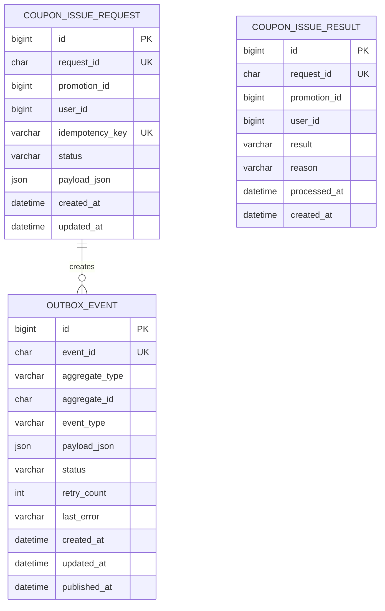

# ERD (Entity Relationship Diagram)

> Promotion Dispatcher 데이터 모델 (현재 설계 기준)

## 목차

- [DB 분리 기준](#db-분리-기준)
- [메인 테이블 ERD](#메인-테이블-erd)
- [관계 설명](#관계-설명)
- [테이블 상세](#테이블-상세)
  - [coupon_issue_request](#coupon_issue_request)
  - [outbox_event](#outbox_event)
  - [coupon_issue_result](#coupon_issue_result)
- [Redis 데이터 구조](#redis-데이터-구조)
- [인덱스 전략](#인덱스-전략)
- [Flyway Migration](#flyway-migration)
- [운영 관점 체크포인트](#운영-관점-체크포인트)
- [DB Lock 최소화](#db-lock-최소화)

---

## DB 분리 기준

로컬 개발에서는 MySQL 컨테이너 1개를 사용하되 database를 분리한다.

```text
mysql:8
  ├─ server_a_db
  └─ server_c_db
```

서비스별 책임:

- Server A는 `server_a_db`만 사용한다.
- Server C는 `server_c_db`만 사용한다.
- Server B는 Redis를 사용하고 MySQL을 직접 사용하지 않는다.
- Server A DB와 Server C DB 사이에는 물리 FK를 두지 않는다.

---

## 메인 테이블 ERD



---

## 관계 설명

- `coupon_issue_request`는 Server A의 요청 접수 원장이다.
- `outbox_event`는 Server A의 메시지 발행 대기열이다.
- `outbox_event.aggregate_id`는 `coupon_issue_request.request_id`를 참조하는 논리 키다.
- `coupon_issue_result`는 Server C의 최종 발급 결과 원장이다.
- `coupon_issue_result.request_id`는 Server A에서 생성한 요청 ID를 사용한다.
- 서비스 간 DB가 분리되어 있으므로 cross-database FK는 사용하지 않는다.
- 정합성은 event contract, idempotency key, unique constraint, RabbitMQ ack/retry로 보장한다.

---

## 테이블 상세

### coupon_issue_request

Server A DB: `server_a_db`

| 컬럼명 | 타입 | 제약조건 | 설명 |
|---|---|---|---|
| `id` | BIGINT UNSIGNED | PK, AUTO_INCREMENT | 내부 식별자 |
| `request_id` | CHAR(36) | NOT NULL, UNIQUE | Server A가 생성한 요청 UUID |
| `promotion_id` | BIGINT UNSIGNED | NOT NULL | 프로모션 식별자 |
| `user_id` | BIGINT UNSIGNED | NOT NULL | 사용자 식별자 |
| `idempotency_key` | VARCHAR(100) | NOT NULL, UNIQUE | 클라이언트 재요청 식별자 |
| `status` | VARCHAR(30) | NOT NULL | `ACCEPTED` |
| `payload_json` | JSON | NOT NULL | 원본 10개 필드 요청 body |
| `created_at` | DATETIME(6) | NOT NULL | 생성 시각 |
| `updated_at` | DATETIME(6) | NOT NULL | 수정 시각 |

인덱스:

- `uq_coupon_issue_request_request_id`: `(request_id)` unique
- `uq_coupon_issue_request_promotion_user`: `(promotion_id, user_id)` unique
- `uq_coupon_issue_request_idempotency_key`: `(idempotency_key)` unique
- `ix_coupon_issue_request_status_created_at`: `(status, created_at)`

### outbox_event

Server A DB: `server_a_db`

| 컬럼명 | 타입 | 제약조건 | 설명 |
|---|---|---|---|
| `id` | BIGINT UNSIGNED | PK, AUTO_INCREMENT | 내부 식별자 |
| `event_id` | CHAR(36) | NOT NULL, UNIQUE | outbox 이벤트 UUID |
| `aggregate_type` | VARCHAR(50) | NOT NULL | 예: `COUPON_ISSUE_REQUEST` |
| `aggregate_id` | CHAR(36) | NOT NULL | `coupon_issue_request.request_id` 논리 참조 |
| `event_type` | VARCHAR(100) | NOT NULL | 예: `issue.requested` |
| `payload_json` | JSON | NOT NULL | RabbitMQ 발행 payload |
| `status` | VARCHAR(30) | NOT NULL | `PENDING`, `PUBLISHED`, `FAILED`, `DEAD` |
| `retry_count` | INT UNSIGNED | NOT NULL | 발행 재시도 횟수 |
| `last_error` | VARCHAR(1000) | NULL | 마지막 실패 원인 |
| `created_at` | DATETIME(6) | NOT NULL | 생성 시각 |
| `updated_at` | DATETIME(6) | NOT NULL | 수정 시각 |
| `published_at` | DATETIME(6) | NULL | 발행 성공 시각 |

인덱스:

- `uq_outbox_event_event_id`: `(event_id)` unique
- `ix_outbox_event_status_created_at`: `(status, created_at)`
- `ix_outbox_event_aggregate`: `(aggregate_type, aggregate_id)`

### coupon_issue_result

Server C DB: `server_c_db`

| 컬럼명 | 타입 | 제약조건 | 설명 |
|---|---|---|---|
| `id` | BIGINT UNSIGNED | PK, AUTO_INCREMENT | 내부 식별자 |
| `request_id` | CHAR(36) | NOT NULL, UNIQUE | Server A 요청 ID |
| `promotion_id` | BIGINT UNSIGNED | NOT NULL | 프로모션 식별자 |
| `user_id` | BIGINT UNSIGNED | NOT NULL | 사용자 식별자 |
| `result` | VARCHAR(30) | NOT NULL | `SUCCESS`, `DUPLICATE`, `SOLD_OUT`, `FAILED` |
| `reason` | VARCHAR(255) | NULL | 실패 또는 중복 사유 |
| `processed_at` | DATETIME(6) | NOT NULL | Server B 처리 시각 |
| `created_at` | DATETIME(6) | NOT NULL | Server C 저장 시각 |

인덱스:

- `uq_coupon_issue_result_request_id`: `(request_id)` unique
- `uq_coupon_issue_result_promotion_user`: `(promotion_id, user_id)` unique
- `ix_coupon_issue_result_result_created_at`: `(result, created_at)`

---

## Redis 데이터 구조

| Key | Type | TTL | 설명 |
|---|---|---:|---|
| `promotion:{promotionId}:stock` | String number | 604800초 | 남은 쿠폰 재고 |
| `promotion:{promotionId}:issued-users` | Set | 604800초 | 이미 발급 처리된 사용자 ID |
| `issue:{requestId}:result` | String | 86400초 | 특정 요청의 Redis 처리 결과 |
| `rate-limit:{userId}` | String number | 60초 | 사용자별 요청량 제한 counter |

Lua script 원자 처리:

```text
1. issue:{requestId}:result가 이미 있으면 기존 결과 반환
2. issued-users에 userId가 있으면 DUPLICATE 저장 후 반환
3. stock이 0 이하면 SOLD_OUT 저장 후 반환
4. stock이 남아 있으면 DECR
5. issued-users에 userId 추가
6. issue:{requestId}:result = SUCCESS 저장
7. result, stock, issued-users key에 TTL 설정
8. SUCCESS 반환
```

Rate limit script:

```text
1. rate-limit:{userId} 값을 INCR
2. 새로 생성된 counter면 60초 TTL 설정
3. counter가 60을 초과하면 거절
4. Redis 연결 실패 시 요청 접수 API 보호를 위해 fail-open
```

### Redis Hot Key

선착순 프로모션은 특정 `promotionId`로 요청이 집중된다.
따라서 `promotion:{promotionId}:stock`, `promotion:{promotionId}:issued-users`는 hot key가 된다.
현재 구현은 Lua script로 정합성을 보장하지만 단일 key 처리량 한계는 남는다.

현재 데이터 모델은 단일 stock key와 단일 issued-users set을 사용한다.
stock bucket/shard는 측정 전 구현하지 않는다.
분산 재고를 도입하면 bucket별 소진, 전체 품절 판단, 중복 발급 방어 범위가 함께 복잡해지기 때문이다.

확장안:

- `promotion:{promotionId}:stock:{bucket}` 형태로 재고 bucket을 나누어 분산 차감
- Redis Cluster로 여러 프로모션 부하 분산
- 인기 프로모션은 시작 전에 bucket별 재고를 사전 적재

---

## 인덱스 전략

| 인덱스 | 목적 |
|---|---|
| `uq_coupon_issue_request_request_id` | 요청 ID 중복 방지 및 조회 |
| `uq_coupon_issue_request_promotion_user` | 사용자별 프로모션 중복 접수 방지 |
| `uq_coupon_issue_request_idempotency_key` | 같은 idempotency key 재요청 방지 |
| `ix_coupon_issue_request_status_created_at` | 상태별 요청 조회 및 운영 확인 |
| `uq_outbox_event_event_id` | outbox event 중복 방지 |
| `ix_outbox_event_status_created_at` | pending outbox relay 조회 |
| `ix_outbox_event_aggregate` | 요청 단위 outbox 추적 |
| `uq_coupon_issue_result_request_id` | 동일 이벤트 중복 저장 방지 |
| `uq_coupon_issue_result_promotion_user` | 최종 사용자별 중복 발급 방지 |
| `ix_coupon_issue_result_result_created_at` | 결과별 발급 현황 조회 |

---

## Flyway Migration

각 서버가 자기 schema만 관리한다.

```text
server-a/src/main/resources/db/migration/V1__create_coupon_issue_request_and_outbox.sql
server-c/src/main/resources/db/migration/V1__create_coupon_issue_result.sql
```

Docker Compose MySQL init script는 database 생성만 담당한다.

```sql
CREATE DATABASE IF NOT EXISTS server_a_db
    DEFAULT CHARACTER SET utf8mb4
    DEFAULT COLLATE utf8mb4_0900_ai_ci;

CREATE DATABASE IF NOT EXISTS server_c_db
    DEFAULT CHARACTER SET utf8mb4
    DEFAULT COLLATE utf8mb4_0900_ai_ci;
```

---

## 운영 관점 체크포인트

- `coupon_issue_request`는 요청 접수 원장이므로 임의 삭제하지 않는다.
- `outbox_event`는 발행 성공 후에도 추적 목적으로 보관한다.
- `outbox_event.status=PENDING` 또는 `FAILED`가 오래 남으면 RabbitMQ 또는 relay 장애를 의심한다.
- `outbox_event.status=DEAD`는 최대 재시도 초과로 운영자 확인이 필요하다.
- `coupon_issue_result`는 최종 결과 원장이며 append-only에 가깝게 운영한다.
- `promotion_id + user_id` unique constraint는 Server C의 최종 중복 발급 방어선이다.
- Redis 재고와 MySQL 최종 결과 수가 일시적으로 다를 수 있으므로 운영 문서에 보정 절차를 남긴다.
- k6 측정에서 Redis hot key 병목이 확인되면 `promotion:{promotionId}:stock:{bucket}` 형태의 stock bucket/shard 확장을 고려한다.

## DB Lock 최소화

쿠폰 발급 hot path에서는 MySQL row lock으로 재고를 차감하지 않는다.
Server A와 Server C는 unique constraint로 중복을 방어하고,
Server B는 Redis Lua script로 재고 차감을 원자 처리한다.

- Server A: `idempotency_key`, `promotion_id + user_id` unique key
- Server B: `promotion:{promotionId}:stock`, `promotion:{promotionId}:issued-users` Lua 원자 처리
- Server C: `request_id`, `promotion_id + user_id` unique key

이 구조는 DB lock 경합을 줄이고, MySQL transaction을 요청 원장과 최종 결과 저장에만 짧게 사용한다.
